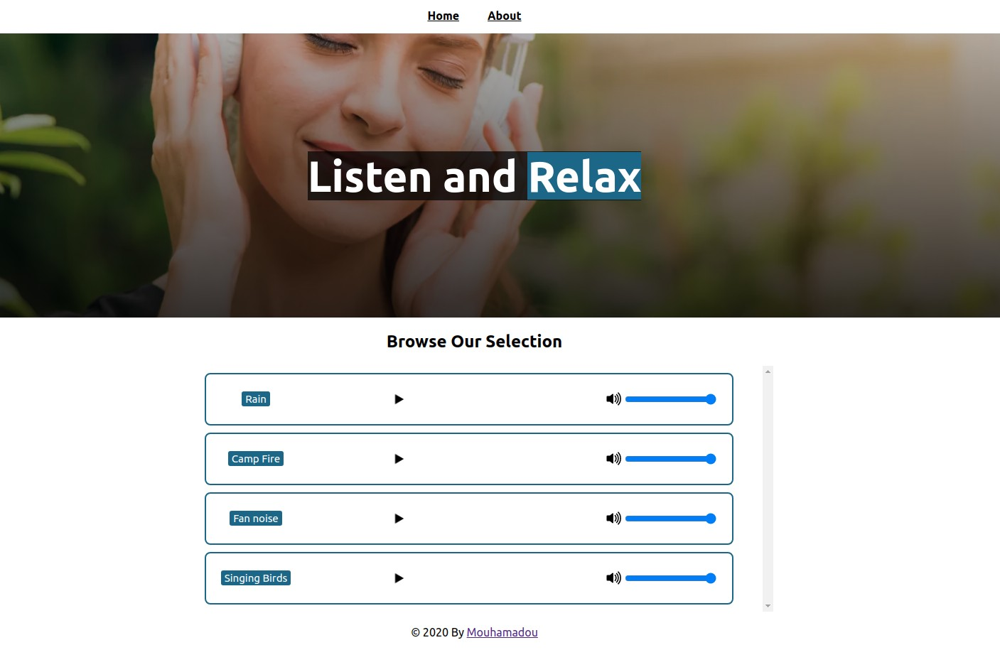

# Listen and relax 

## Technologies

- React
- React-DOM
- Create-React-App
- React Router
- Eslint
- npm
- CSS

## Live Version 
<a href="https://deeprelax.netlify.app/" target="_blank" > Live version </a>

## Usage 
### Clone the project: 
 - git clone https://github.com/MouhaDiouf/relax-sounds
 ### Run the project
 - to install the dependencies run the command : npm install 
 - after installation, run the command: npm start

## Description 
This is an application that help people get more focus through the power of nature sounds. 

## Developed by

Mouhamadou Diouf ( <a href="https://github.com/MouhaDiouf"> @mouhad </a>)

## Contributing

1. Fork it (https://github.com/MouhaDiouf/relax-sounds)
2. Create your feature branch (git checkout -b feature/[choose-a-name])
3. Commit your changes (git commit -am 'What this commit will fix/add')
4. Push to the branch (git push origin feature/[chosen name])
5. Create a new Pull Request

